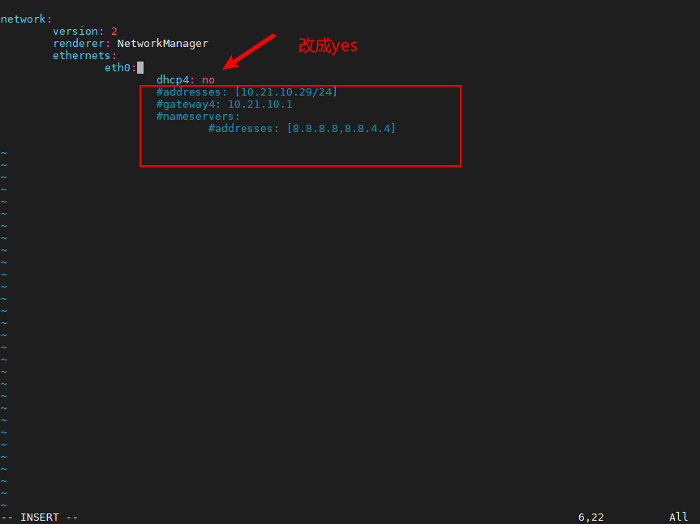

# Viobot网络配置之dhcp

其实并不推荐使用dhcp，因为如果是把设备安装在固定场景中组网的话，我们还是希望这个设备它本身的ip能够固定下来，这样至少省去了查找设备ip的麻烦。

但如果使用场景特殊，确实需要dhcp来给设备分配ip的话，也是可以的。

ssh登录设备后

```bash
sudo cp /etc/netplan/01-netcfg.yaml /etc/netplan/01-netcfg.yaml.backup#备份文件
sudo vim /etc/netplan/01-netcfg.yaml
```

把dhcp4改成yes，下面几行全部注释掉，注意缩进，然后保存退出。


