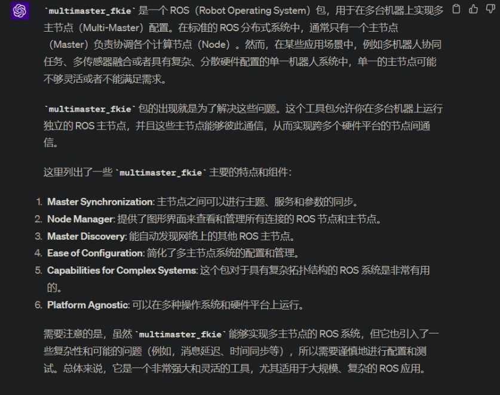
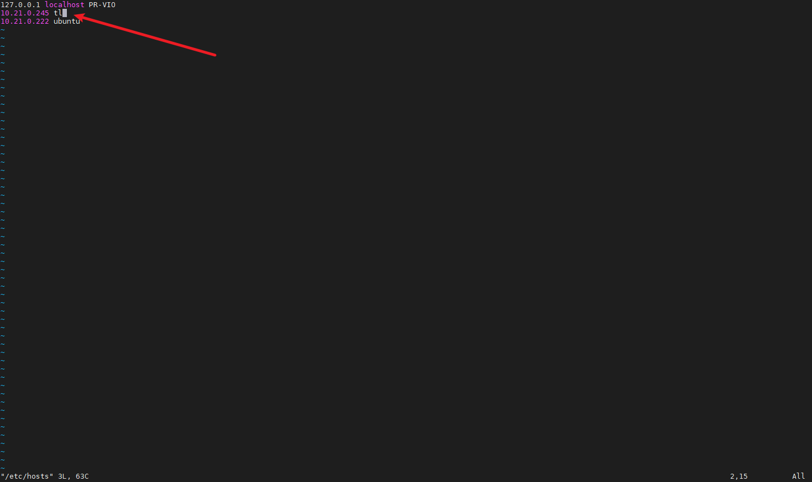

# Viobot ROS多主机配置

主要是针对ROS版本下的，因为ROS本身master节点只能够有一个，如果把个人电脑设置为主机，把viobot设置为从机的话，设备本身的程序启动会一直寻找主机，导致很多功能不能正常使用。只有在个人电脑正常运行，能够设备稳定通信，而且开启了ROS master的情况下才能使用，限制比较大，现介绍一种方法，能够让你的个人电脑配置了从机之后，在不连接viobot的情况下也能够正常使用ROS的功能。

这就是`multmaster fkie`，截图GPT的回答：



以下教程以ubuntu20.04 + ROS Noetic为例。

设备1为我的虚拟机IP：`10.21.0.245`，设备2为Viobot IP：`10.21.0.208`

## 1.分别编译`multmaster fkie`

#### (1)首先配置虚拟机环境

编译`multmaster fkie`

```bash
mkdir -p mult_master/src
cd mult_master/src
git clone https://github.com/fkie/multimaster_fkie.git multimaster
#如果git clone下载太慢的话，也可以直接上github下载压缩包下来，拉到虚拟机和Viobot里面解压
#安装依赖
pip3 install grpcio
pip3 install grpcio-tools 
cd ..
catkin build
#如果catkin build命令报错的话，需要手动安装catkin build
#sudo apt install python-catkin-tools

```

#### (2)编译Viobot的环境

此步骤需要确保Viobot的网络配置在一个能够联网的IP段

```bash
mkdir -p mult_master/src
cd mult_master/src
git clone https://github.com/fkie/multimaster_fkie.git multimaster
#如果git clone下载太慢的话，也可以直接上github下载压缩包下来，拉到虚拟机和Viobot里面解压
sudo apt update
sudo apt install python3-pip
pip3 install --upgrade setuptools
pip3 install grpcio
pip install grpcio-tools
cd ..
catkin build

```

## 2.配置网络环境

#### （1）虚拟机添加host

```bash
sudo gedit /etc/hosts

```

添加Viobot的IP和hostname


#### （2）Viobot添加host

```bash
sudo vim /etc/hosts

```

添加虚拟机的IP和hostname



## 3.增加网络配置

下面的操作两者都做一遍即可

```bash
sudo vim /etc/sysctl.conf #shift+g跳转到最后一行，o添加，然后加上下面的两行，保存退出
net.ipv4.ip_forward=1 #启用 IP 数据包转发，允许 Linux 系统作为路由器来转发数据包。
net.ipv4.icmp_echo_ignore_broadcasts=0 #允许系统响应广播 ICMP 回显请求。
#回到终端重新启动 procps 服务
sudo service procps restart
```

两边都做完可以测试以下广播是否生效

```bash
ping 224.0.0.1
```

虚拟机：


Viobot：


如果都能够看到彼此的IP即配置完成

## 4.测试multmaster多机通信

由于Viobot设备自启动有一个master节点和传感器的数据读取，所以不需要另外再启动其他节点

虚拟机操作：

第一个终端

```bash
roscore 
```

第二个终端

```bash
cd mult_master
source ./devel/setup.bash
rosrun fkie_master_discovery master_discovery

```

第三个终端

```bash
cd mult_master
source ./devel/setup.bash
rosrun fkie_master_sync master_sync

```

Viobot操作：

```bash
cd mult_master
source ./devel/setup.bash
rosrun fkie_master_discovery master_discovery
```

所有东西都开起来后，就可以在虚拟机端，看到Viobot的话题了。

虚拟机新开终端，打开rqt就可以看到画面了。
