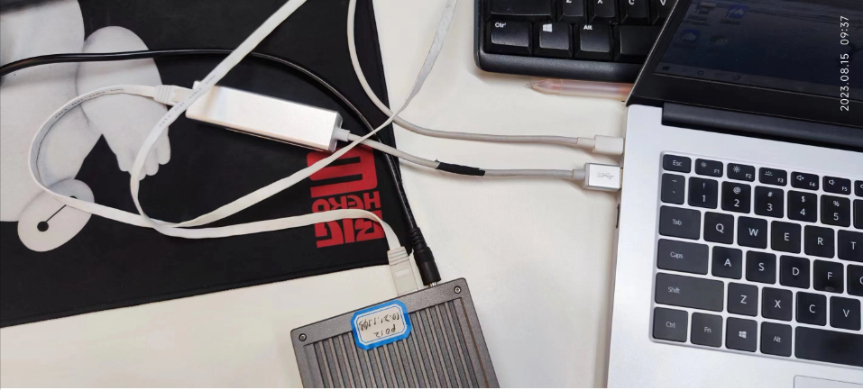
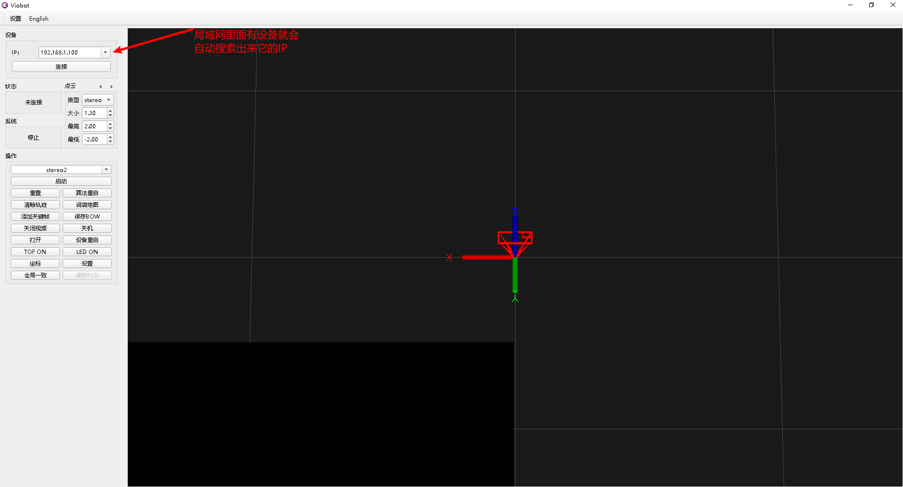
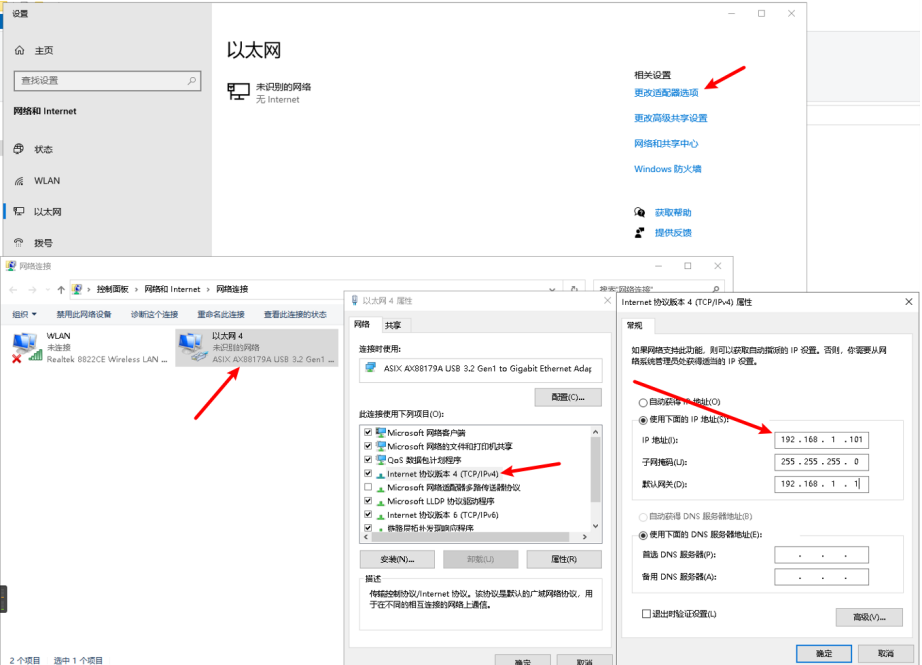
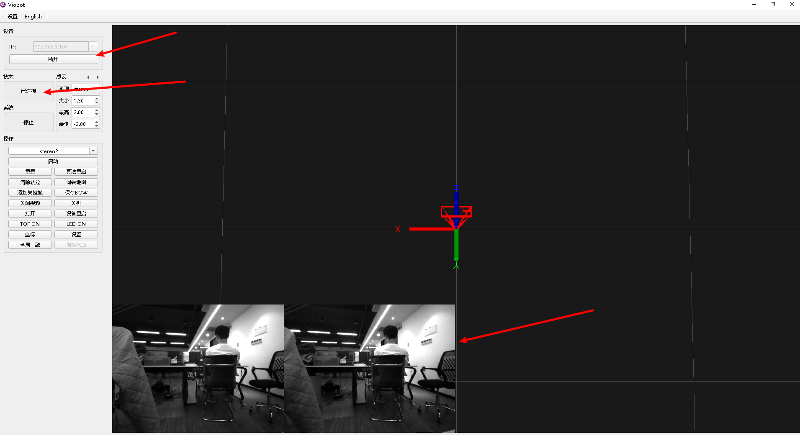
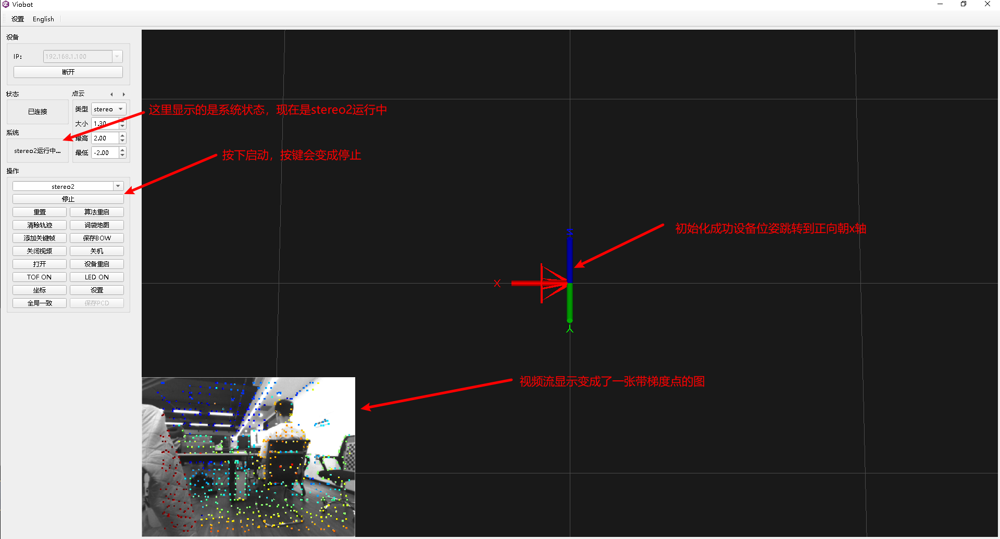
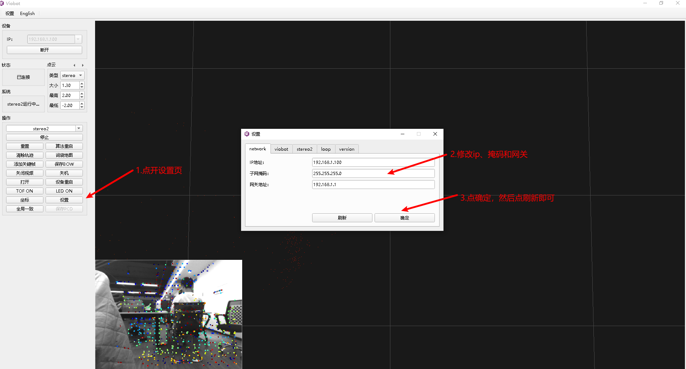

# Viobot开机指南

### 1.上电

首先，我们先要把设备接上电源线和网线，最简单的方式就是网线直连电脑。&#x20;

电源选用12V1.5A设备自带的电源即可。

### 2.配置网络

设备直连电脑能够通过上位机自动搜索到设备IP，这个功能可以用来解救我们修改IP出错或者是修改了IP后忘记了自己修改的IP的情况。

注意：搜索功能只是把设备搜索出来，当你电脑的IP段与设备不一致的时候，是连接不上的，所以我们需要按照下面的方法配置一下自己电脑的IP使得能够通过上位机连接到设备。

设备默认IP是`192.168.1.100`，我们就把电脑的ip设置为`192.168.1.101`

确定之后，开启命令行，试ping一下`192.168.1.100` 能够ping通则已配置完成。

### 3.连接设备

能ping通后，点连接即可。

连接成功后，状态栏会变成已连接状态，左下角的视频流会刷新，挪动一下设备，看视频流是否正常、流畅。

### 4.启动测试

梯度点由近到远颜色次序是：红橙黄绿青蓝紫。我们可以通过这个图片看到算法当前状态的表现，如果图片上的点基本符合上述颜色次序，则运行正常，少量的错点可忽略$。$如果刚开的时候很多错点，可以稍微挪动一下设备，更新关键帧，即可恢复正常。

接下来，我们就可以将设备运动起来，看它的具体表现（位姿，图片上面的点颜色）是否正常，所有测试都正常，则可以做后面的工作了。（比如说用到自己的场景下，或者直接上车等等）

### 5.修改ip

实际使用我们可能不会将设备直连电脑，或者就是我的网络下面的`192.168.1.100`IP已经有其他的电脑占用了，故需要修改IP。

修改IP是需要重启才能够生效的，上位机的按键有一个设备重启的按键，可以直接重启设备。

如果我们设置IP的时候设置错了，或者是忘记了自己设置的IP，可以参照2所说的，上位机会自动搜索到局域网内的设备的IP。
