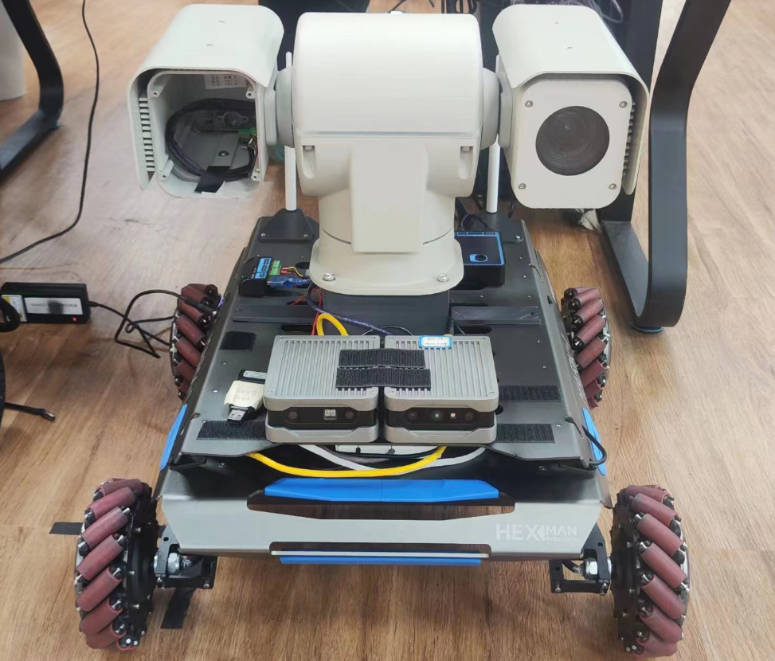
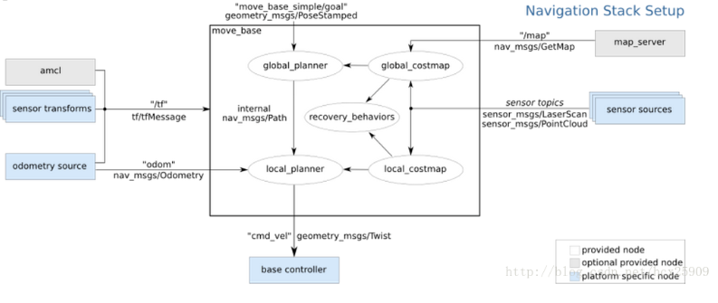
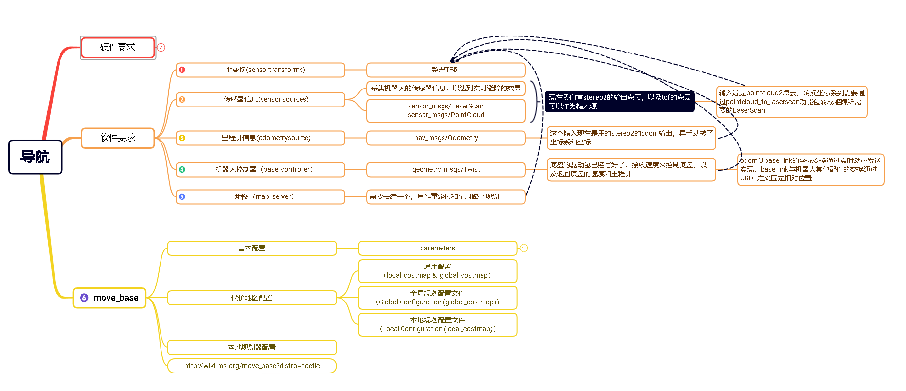
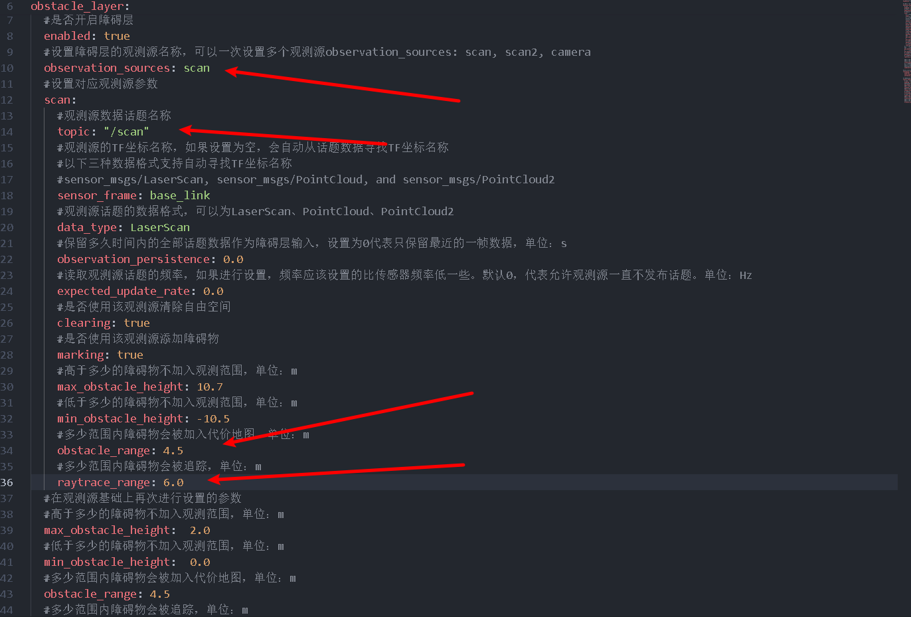

# Viobot定位用于导航

注：此教程以轮式机器人作为一个样例，具体的应用还需要用户自己去做更深入的开发。



路径规划部分我们选用轮式机器人比较常用的move\_base。

整个架构就是Viobot使用stereo2算法提供机器人的当前位姿，输入到move\_base作为规划起点，再给定目标终点，move\_base会输出一个/cmd\_vel的话题使机器人运动起来。至于/cmd\_vel到控制机器人底盘运动（也就是base controller这部分）的实现就要用户自己去实现了，我们先默认都已经可以实现base controller了。



下面是我整理的一张整体的框架图



接下来就是例程的粗略讲解

### 1.viobot输出信息处理

接收stereo2的位姿和点云，使用TF转换，构建TF树。

#### 1）接收消息，注册回调函数

```c++
std::string point_clound_topic;
//点云话题配置接口，可以通过launch文件配置点云输入，默认为TOF
nh_private.param<std::string>("point_clound_topic", point_clound_topic, "/pr_loop/tof_points");

sub_odom = nh.subscribe("/pr_loop/odometry_rect", 50, &VioOdomNodelet::loop_pose_callback, this);
sub_car_odom = nh.subscribe("/odom", 50, &VioOdomNodelet::car_odom_callback, this);
sub_pointcloud = nh.subscribe(point_clound_topic, 50, &VioOdomNodelet::loop_pointclound_callback, this);
```

#### 2）回调函数处理位姿信息

自己去维护了一个从`base_link`到`vio_odom`的动态TF变换

```c++
void VioOdomNodelet::loop_pose_callback(const nav_msgs::OdometryPtr &msg){
    static tf::TransformBroadcaster odom_broadcaster;//定义tf 对象
    geometry_msgs::TransformStamped odom_trans;//定义tf发布时需要的类型消息
    nav_msgs::Odometry odom;

    odom.header.stamp = msg->header.stamp;
    odom.header.frame_id = "vio_odom";
    odom.child_frame_id = "base_link";
    Eigen::Vector3d position_in_vio(msg->pose.pose.position.x, msg->pose.pose.position.y,msg->pose.pose.position.z);
    
    tf::Quaternion original_quat(msg->pose.pose.orientation.x, msg->pose.pose.orientation.y, msg->pose.pose.orientation.z, msg->pose.pose.orientation.w);
    
    //选转到跟base_link方向一致
    tf::Quaternion quat_rotate;
    quat_rotate.setRPY(0, -M_PI/2, M_PI/2);
    // quat_rotate.setRPY(0,M_PI/2, -M_PI/2);

    // Apply the rotations
    tf::Quaternion final_quat = original_quat * quat_rotate;
    
    // Convert the final quaternion back to a geometry_msgs Quaternion
    geometry_msgs::Quaternion geo_q;
    tf::quaternionTFToMsg(final_quat, geo_q);

    if(height_charge){//一个将Z轴归零的策略，可根据自己的实际情况配置
        frame_z = msg->pose.pose.position.z;
        position_in_vio.z() = 0;
        odom.pose.pose.position.z = 0;//z轴归零
        //这里为了把位姿朝向规整到水平面
        vio_quat = geo_q;
        // printf("--------------------\npose:\nx:%lf\ny:%lf\nz:%lf\nquat:\nx:%lf\ny:%lf\nz:%lf\nw:%lf\n",msg->pose.pose.position.x,msg->pose.pose.position.y,
        //                                                             msg->pose.pose.position.z,msg->pose.pose.orientation.x,msg->pose.pose.orientation.y,
        //                                                             msg->pose.pose.orientation.z,msg->pose.pose.orientation.w);
        double yaw = tf::getYaw(vio_quat);
        // geometry_msgs::Quaternion geo_q1 = tf::createQuaternionMsgFromYaw(yaw + M_PI / 2);
        geometry_msgs::Quaternion geo_q1 = tf::createQuaternionMsgFromYaw(yaw);

        odom.pose.pose.orientation = geo_q1;
    }
    else{
        odom.pose.pose.position.z = msg->pose.pose.position.z;
        odom.pose.pose.orientation = geo_q; 
    } 

    position_in_vio = position_in_vio + t_vio_base_link;

    // Coordinate transformation from VIO to base_link
    // odom.pose.pose.position.x = position_in_vio.x();
    // odom.pose.pose.position.y = position_in_vio.y();
    // odom.pose.pose.position.z = position_in_vio.z();
    odom.pose.pose.position.x = msg->pose.pose.position.x;
    odom.pose.pose.position.y = msg->pose.pose.position.y;

    //这里odom的速度可选stereo2输出的速度，也可以选择底盘论速计的速度
    // odom.twist.twist.linear.x = msg->twist.twist.linear.x;
    // odom.twist.twist.linear.y = msg->twist.twist.linear.y;
    odom.twist.twist.linear.x = linear_vx;
    odom.twist.twist.linear.y = linear_vy;
    odom.twist.twist.linear.z = 0.0;
    odom.twist.twist.angular.x = 0.0;
    odom.twist.twist.angular.y = 0.0;
    odom.twist.twist.angular.z = angular_vz;
    // odom.twist.twist.angular.z = msg->twist.twist.angular.z;

    odom_trans.header.stamp = msg->header.stamp;
    odom_trans.header.frame_id = "vio_odom";
    odom_trans.child_frame_id = "base_link";
    odom_trans.transform.translation.x = position_in_vio.x();//x坐标
    odom_trans.transform.translation.y = position_in_vio.y();//y坐标
    odom_trans.transform.translation.z = position_in_vio.z();//z坐标        
    odom_trans.transform.rotation = odom.pose.pose.orientation;//偏航角
    odom_broadcaster.sendTransform(odom_trans);

    //区分静止和运动时的协方差
    if(msg->twist.twist.linear.y == 0 && msg->twist.twist.linear.x == 0 && msg->twist.twist.angular.z == 0){
        memcpy(&odom.pose.covariance, odom_pose_covariance2, sizeof(odom_pose_covariance2));
        memcpy(&odom.twist.covariance, odom_twist_covariance2, sizeof(odom_twist_covariance2));
    }
    else{
        memcpy(&odom.pose.covariance, odom_pose_covariance, sizeof(odom_pose_covariance));
        memcpy(&odom.twist.covariance, odom_twist_covariance, sizeof(odom_twist_covariance));
    }
    pub_odom.publish(odom);
}
```

#### 3）回调函数处理点云信息

把点云划到vio\_odom上面，它会根据上面的`base_link`到`vio_odom`的动态TF变换变换

```c++
void VioOdomNodelet::loop_pointclound_callback(const sensor_msgs::PointCloud2ConstPtr& cloud_msg_in){
    sensor_msgs::PointCloud2 cloud_msg_out = *cloud_msg_in;

    // Set the frame_id of the output pointcloud to base_link
    cloud_msg_out.header.frame_id = "vio_odom";

    if(height_charge){
        Eigen::Quaterniond q(vio_quat.w, vio_quat.x, vio_quat.y, vio_quat.z);
        Eigen::Matrix3d rotation_matrix = q.normalized().toRotationMatrix();

        //将Eigen::Matrix3d 手动转换为 tf::Matrix3x3
        tf::Matrix3x3 tf_rotation_matrix(rotation_matrix(0, 0), rotation_matrix(0, 1), rotation_matrix(0, 2),
                                        rotation_matrix(1, 0), rotation_matrix(1, 1), rotation_matrix(1, 2),
                                        rotation_matrix(2, 0), rotation_matrix(2, 1), rotation_matrix(2, 2));

        double yaw, pitch, roll;
        tf_rotation_matrix.getRPY(roll, pitch, yaw);

        //创建pitch和roll的逆旋转
        Eigen::Matrix3d pitch_matrix_inv = Eigen::AngleAxisd(-pitch, Eigen::Vector3d::UnitY()).toRotationMatrix();
        Eigen::Matrix3d roll_matrix_inv = Eigen::AngleAxisd(-roll, Eigen::Vector3d::UnitX()).toRotationMatrix();

        Eigen::Matrix3d final_rotation_matrix;
        // 应用逆旋转到原始四元数上
        if(inv){
            final_rotation_matrix = pitch_matrix_inv * roll_matrix_inv;
        }
        else{
            final_rotation_matrix << 1,0,0,0,1,0,0,0,1;
        }

        sensor_msgs::PointCloud pointcl1;
        sensor_msgs::convertPointCloud2ToPointCloud(cloud_msg_out,pointcl1);
        for(int i = 0;i < pointcl1.points.size();i++){
            Eigen::Vector3d point_eigen(pointcl1.points[i].x, pointcl1.points[i].y, pointcl1.points[i].z);
            point_eigen = final_rotation_matrix * point_eigen;
            pointcl1.points[i].x = point_eigen.x();
            pointcl1.points[i].y = point_eigen.y();
            pointcl1.points[i].z = point_eigen.z() - frame_z;
            // printf("frame_z = %lf\n",frame_z);
        }
        sensor_msgs::convertPointCloudToPointCloud2(pointcl1,cloud_msg_out);  
    }
    pub_pointcloud.publish(cloud_msg_out);
}
```

### 2.pointcloud转laserscan

其实就是根据原有的开源代码做了一下修改，原有的代码配置了use\_inf为false时，当点云的距离大于range\_max就不显示了，这样会造成一些刷新上面的困难，所以再输出/scan话题之前加了1.5m的距离，让/scan话题初始就是一个range\_max+1.5的扇形，根据障碍物来刷新。

### 3.move\_base配置

#### 1）launch文件

主要是启动map\_server加载地图文件和启动move\_base并加载了配置文件。

```xml
<launch>
    <!-- Run the map server -->
    <node name="map_server" pkg="map_server" type="map_server" args="$(find nav_robot)/maps/map_office.yaml"/>
    <!-- <node name="map_server" pkg="map_server" type="map_server" args="$(find nav_robot)/maps/blank_map.yaml"/> -->


    <node pkg="move_base" type="move_base" respawn="false" name="move_base" output="screen">
        <rosparam file="$(find nav_robot)/config/mark_1/costmap_common_params.yaml" command="load" ns="global_costmap" />
        <rosparam file="$(find nav_robot)/config/mark_1/costmap_common_params.yaml" command="load" ns="local_costmap" />
        <rosparam file="$(find nav_robot)/config/mark_1/local_costmap_params.yaml" command="load" />
        <rosparam file="$(find nav_robot)/config/mark_1/global_costmap_params.yaml" command="load" />
        <rosparam file="$(find nav_robot)/config/mark_1/move_base_teb_params.yaml" command="load" />
        <rosparam file="$(find nav_robot)/config/mark_1/teb_local_planner_params.yaml" command="load" />
    </node>
    <!-- <node name="rviz" pkg="rviz" type="rviz" args="-d $(find nav_robot)/rviz_cfg/nav_test.rviz" /> -->

</launch>
```

#### 2）地图文件

这个需要用户把自己的场景先建里一个地图先验，可以是使用雷达等设备，也可以使用viobot（这个建图要单独开一篇来讲）。

#### 3）move\_base配置文件

每个文件的参数都有详细注释，用户可以自行查看参数的意义和选择配置。

`costmap_common_params.yaml`这个有一part需要重点说明的：

障碍物层输入是/scan ，不使用pointcloud是因为move\_base底层代码逻辑，避障是使用世界系的点云的，其实避障使用body系点云应该是更合理的，所以我们把一定高度范围的pointcloud转成了/scan；其次是obstacle\_range和raytrace\_range两个参数，它会跟踪raytrace\_range范围内的障碍物，但是只有在obstacle\_range范围内的障碍物点才会被加到代价地图，所以我们前面在转/scan的出话题的时候加了那个1.5m就是为了把大部分点定到obstacle\_range和raytrace\_range中间，使得障碍物能够快速被刷新。



range\_max
