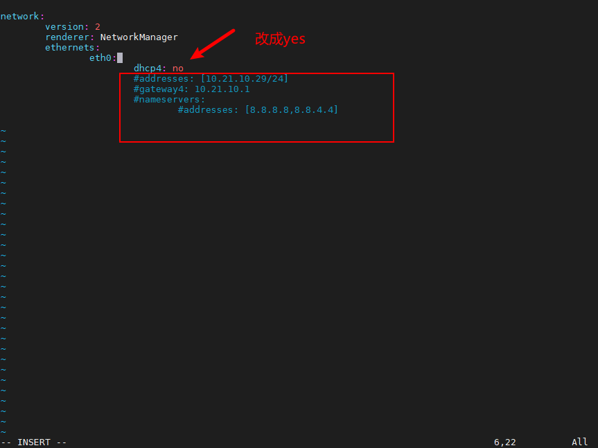

# dhcp

UI按打开，找到install/share/viobot/config/viobot.yaml文件打开，把net\_config\_set改成false，保存，重启设备。


电脑ip加一个段：10.21.0.100  &#x20;

再远程进去ssh [root@10.21.0.223](mailto:root@10.21.0.223 "root@10.21.0.223")&#x20;

```bash
vim /etc/netplan/01-netcfg.yaml
```

把dhcp4改成yes，下面几行全部注释掉


