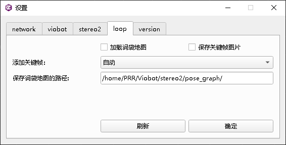
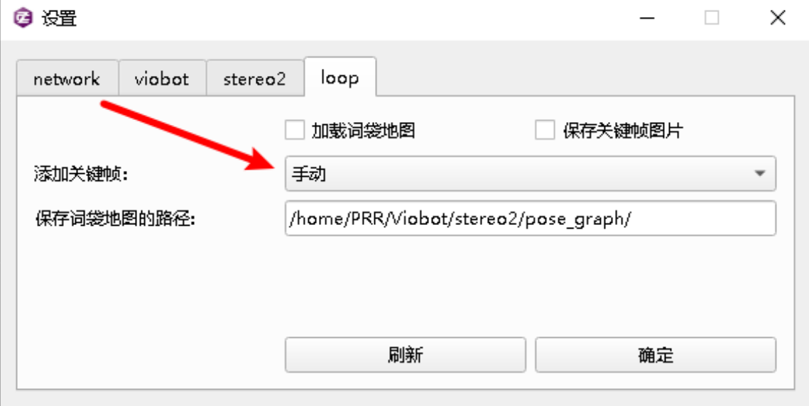
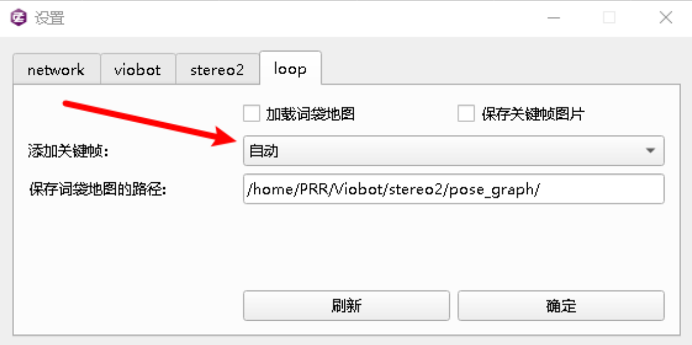
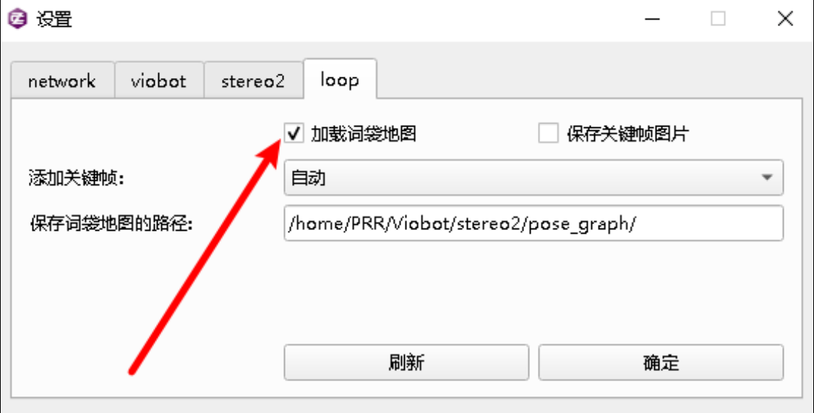
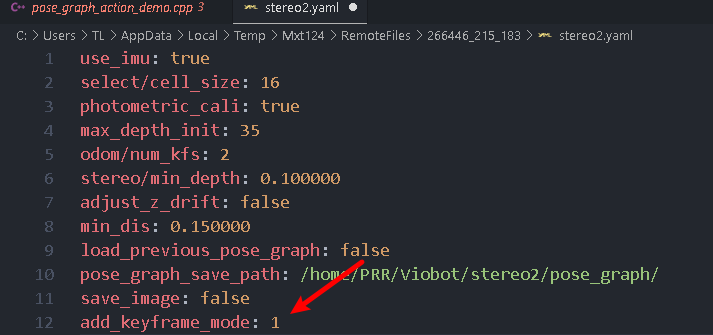
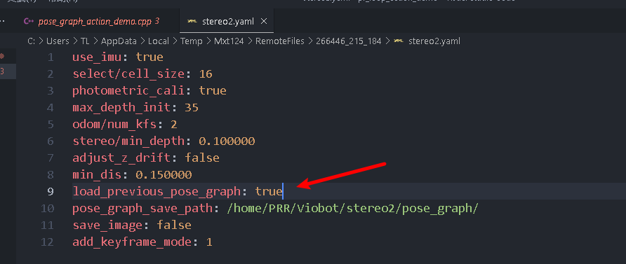
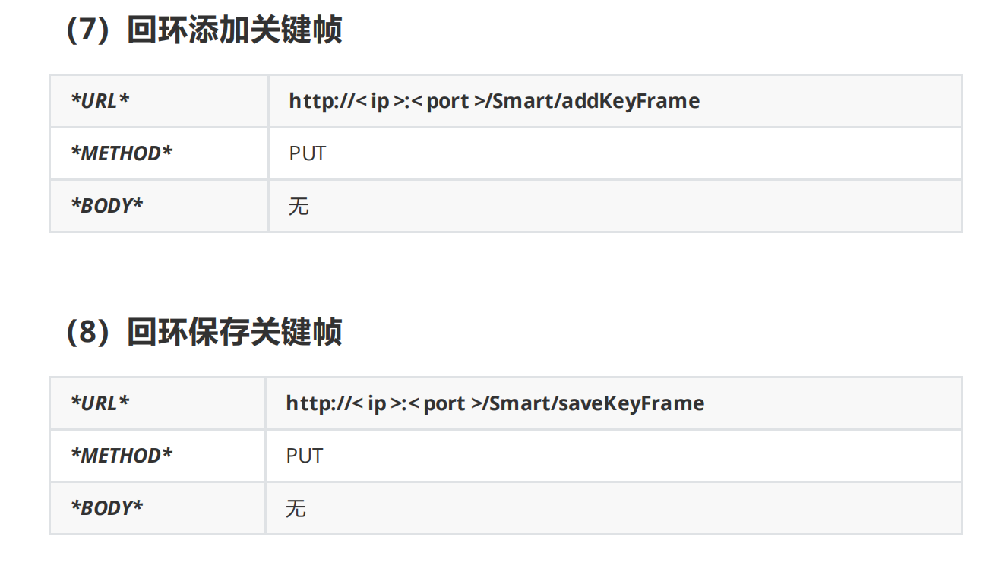

# 回环使用

-   [一.上位机操作](#一上位机操作)
    -   [词袋使用方法](#词袋使用方法)
        -   [记录词袋](#记录词袋)
            -   [（1）手动拍摄](#1手动拍摄)
            -   [（2）自动拍摄](#2自动拍摄)
        -   [加载词袋信息](#加载词袋信息)
-   [二.ROS操作](#二ROS操作)
    -   [1.修改配置文件](#1修改配置文件)
    -   [2.记录词袋](#2记录词袋)
    -   [3.加载词袋](#3加载词袋)
    -   [1.修改配置文件](#1修改配置文件)
    -   [2.记录词袋](#2记录词袋)
    -   [3.加载词袋](#3加载词袋)

Viobot回环是使用词袋匹配的方式，，当新的关键帧能够匹配词袋里面记录过的关键帧时，触发回环，将设备的当前位姿拉到历史位姿。

## 一.上位机操作

### 词袋使用方法

连接上设备，先停止算法。

UI上点 设置 选到 loop 选项卡



#### 记录词袋

注意加载词袋地图的勾不要勾上，勾上表示加载之前的词袋地图。

注意将 保存词袋地图的路径 设置为自己想要保存的路径（设备上，不是用户电脑）

#### （1）手动拍摄

将添加关键帧设置为手动，点确定



启动算法

初始化完成后，将相机移动到需要拍摄的位置，点击UI上的 添加关键帧 或者执行例程里面的添加关键帧操作。

当完成所有拍摄点拍摄后，点击UI的 保存BOW 或者执行例程里面的保存关键帧操作。

#### （2）自动拍摄

将添加关键帧设置为自动，点确定。



启动算法

初始化完成后，将相机移动到需要拍摄的位置，点击UI上的 添加关键帧 或者执行例程里面的添加关键帧操作。

当完成所有拍摄点拍摄后，点击UI的 保存BOW 或者执行例程里面的保存关键帧操作。

#### 加载词袋信息

关闭算法



将配置 `项加载词袋地图` 的勾勾上。

将 `添加关键帧 `设置为自动，点击确定。

启动算法，会自动加载保存在 `保存词袋地图的路径` 的词袋地图，当新的关键帧能够匹配上词袋里面的关键帧时，则会触发回环。

## 二.ROS操作

#### 1.修改配置文件

修改设备里面的"/home/PRR/Viobot/install/share/stereo2/config/stereo2.yaml"这个文件：



add\_keyframe\_mode为1则是自动添加关键帧，0则为手动添加关键帧。修改文件并保存即可。

#### 2.记录词袋

开启算法，记录词袋地图。自动添加关键帧模式下也能够手动继续添加关键帧。

在记录词袋的时候开启我们的pr\_loop\_action\_demo的程序，并且输入数字1，添加关键帧，这个demo只是一次执行的，所以如果需要多次添加关键帧就需要多次开启程序，当然，用户也可以自行将程序改成自己的用输入键值多次调用的方式。输入数字1则为添加关键帧。

当记录的词袋足够了之后再次开启程序，输入数字2即可保存。

当你没有停止算法或者重启算法的时候，再次添加关键帧或者保存词袋都是再原有的词袋地图上面继续添加的。

#### 3.加载词袋

停止算法。

修改设备里面的"/home/PRR/Viobot/install/share/stereo2/config/stereo2.yaml"这个文件：



将load\_previous\_pose\_graph改为true，保存文件。

启动算法会自动加载保存在`pose_graph_save_path`的词袋地图，当新的关键帧能够匹配上词袋里面的关键帧时，则会触发回环。

ROS2通过命令行发送action

```c++
ros2 action send_goal /your_action_server loop_action/MyAction "{function: 1}"

```

`/your_action_server`应该是你的Action服务器的实际名称，`loop_action/MyAction`是包名和Action类型的组合，`{function: 1}`则是你要发送的实际目标。

三.http操作

#### 1.修改配置文件

修改设备里面的"/home/PRR/Viobot/install/share/stereo2/config/stereo2.yaml"这个文件：


add\_keyframe\_mode为1则是自动添加关键帧，0则为手动添加关键帧。修改文件并保存即可。

#### 2.记录词袋

开启算法，记录词袋地图。自动添加关键帧模式下也能够手动继续添加关键帧。



当你没有停止算法或者重启算法的时候，再次添加关键帧或者保存词袋都是再原有的词袋地图上面继续添加的。

#### 3.加载词袋

停止算法。

修改设备里面的"/home/PRR/Viobot/install/share/stereo2/config/stereo2.yaml"这个文件：


将load\_previous\_pose\_graph改为true，保存文件。

启动算法会自动加载保存在`pose_graph_save_path`的词袋地图，当新的关键帧能够匹配上词袋里面的关键帧时，则会触发回环。
