# 基本功能使用及介绍

设备拿到手当然是要先试一下效果的，这部分可以参考本专栏的第一篇\<Viobot开机指南>

接下来我们就从UI开始熟悉这个产品吧！

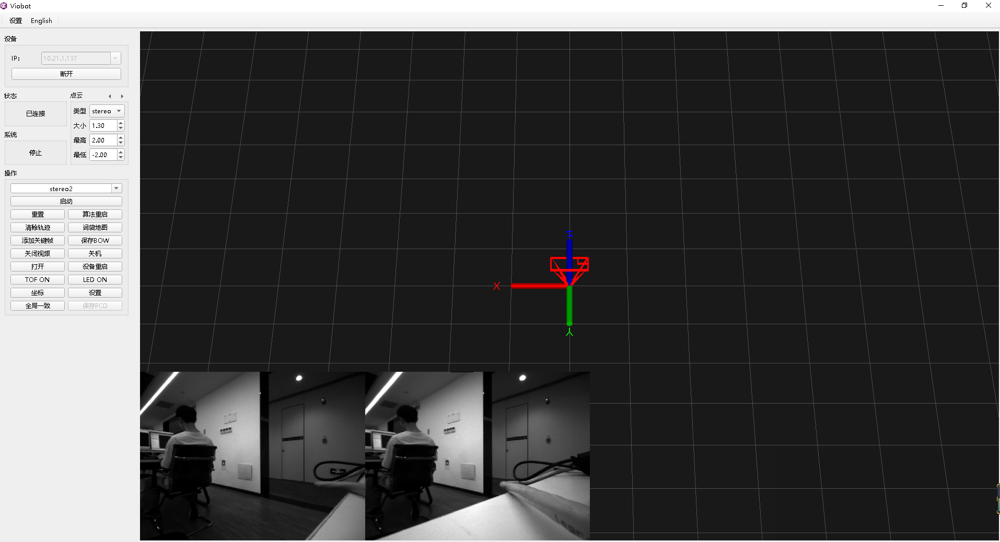

### 1.状态

设备上电会自动运行它的程序，开启了一个服务器，上位机通过连接这个服务器连接到设备，连接成功后就如上图所示，状态栏会显示已连接。

此时它的系统的算法状态是停止状态的，这个系统状态有七个状态：

&#x20;1）停止&#x20;

&#x20;2）mono1初始化中

&#x20;3）mono1运行中

&#x20;4）stereo1初始化中

&#x20;5）stereo1运行中

&#x20;6）stereo2初始化中

&#x20;7）stereo2运行中

对应着SDK上面的定义：

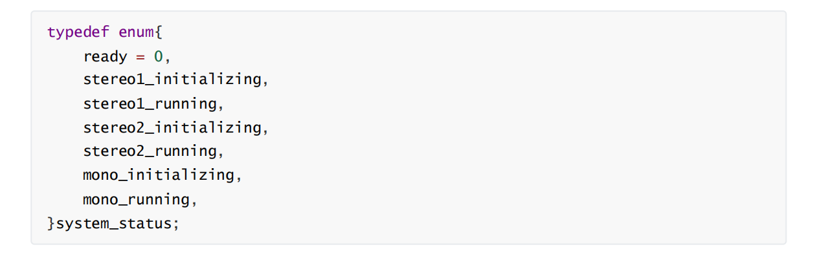

### 2.点云

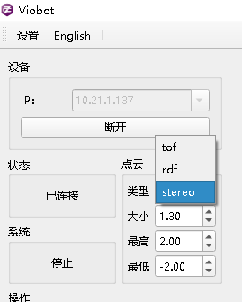

&#x20; 上位机有点云显示类型的选择，分别是stereo、tof和rdf三种

&#x20; stereo点云是算法的原生输出点云，也就是对应的ROS话题`/pr_loop/points`

&#x20; rdf点云对应滤波后的点云，对应的ROS话题`/pr_loop/points_rdf` ，此功能基础版是没有的！

&#x20; tof点云只有在TOF版本开启TOF传感器并且stereo2算法启动了TOF建图才会有输出，对应的ROS       话题为`/pr_loop/tof_points`

还可以设置上位机接收到的点云的显示大小，以及点云显示的范围（主要是Z轴上面的范围），当点云的Z坐标大于最高值或者小于最小值的时候，点云就不会显示在上位机界面。

### 3.操作面板

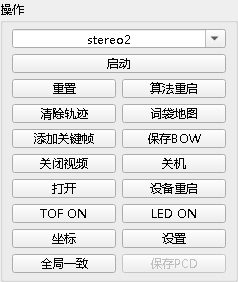

#### 1）算法选择

stereo2所在的框可以点击右边的倒三角选择启动的算法。

算法包含了stereo2、stereo1和mono1

mono1是一个单目的测试例程，需要激励才能完成初始化，用于测试。

stereo1是一个双目的测试例程，启动能够直接完成初始化，但是效果一般，已被弃用。

stereo2是我们设备自带的主SLAM算法，会长期维护并更新升级。

#### 2）算法控制

算法控制包含了六个按键

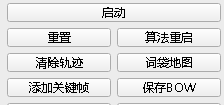

&#x20;   启动：点击即可启动选中的算法，启动后上面的系统状态会更新到相应的状态，启动按钮会变成停                   止，点击停止即可停止算法。

&#x20;   重置：重置设备当前位姿，但不清除词袋信息，当设备触发词袋回环时，仍可重定位到之前词袋记               录的位姿。

&#x20;   算法重启：重启整个算法，并清除之前记录并加载在算法的词袋信息，词袋会重新开始记录。
&#x20;   清除轨迹：清除UI当前显示的轨迹和点云。

词袋地图：加载词袋地图时，在UI上面显示关键帧位姿。

添加关键帧 ：手动添加一帧关键帧到词袋里面。

保存BOW ：将本次运行生成的词袋地图保存到指定路径。

#### 3）其他控制

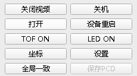

关闭视频 ：关闭UI视频流显示。

关机 ：关闭设备的程序，用于程序升级。

打开：打开设备的文件服务器，用于修改配置，查看保存的文件等。

设备重启：点击按钮后，整个设备系统会直接重启，用于一些配置向修改生效。

TOF ON(OFF) ：TOF手动开关（TOF版可用）

LED ON(OFF) ：补光灯手动开关(补光灯版可用)

坐标 ：设备当前位姿显示。

全局一致：根据运行过程的关键帧重新生成一个完整的点云地图，加入滤波和修正。

保存PCD：将全局一致生成的点云保存PCD。

### 4.设置页面

点击设置页面，会弹出一个小窗口，对应五个标签栏

#### 1）network

设置对应网络的ip、子网掩码、网关，配置后点确定，设备重启即可生效。

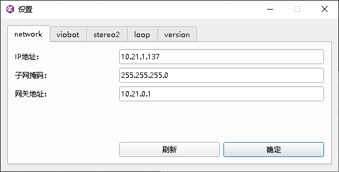

#### 2）viobot

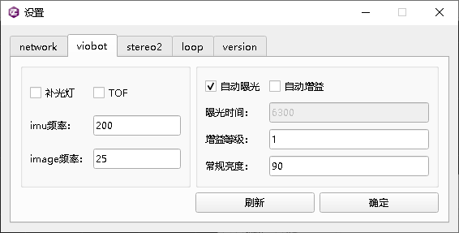

此页面设置需要重启设备才能生效！

左边补光灯和TOF的勾勾上表示设备上电启动时会自动开启补光灯/TOF，如果需要手动开启可以点击UI上面那两个独立按键。

imu频率：默认200Hz，现最高支持400Hz，没有特殊需求一般不建议修改。

image频率：相机帧率，基础版兼顾开销最好的是15fps，PRO版25fps。

自动曝光：前面的勾勾上则开启自动曝光，根据下面设置的常规亮度来调节相机成像亮度，如果不需                  要自动曝光，则将勾去掉，单独设置下面的曝光时间。

自动增益：前面的勾勾上则开启自动增益，该功能在场景特别暗的时候好用，但在一般场景下，开启                  自动增益可能会影响算法精度。

曝光时间：曝光时间在去掉上面的自动曝光的勾时可设置，如果要用到这个设置，可能需要用户自行                  根据不同设置值下的成像表现来设置，属于经验值。调大图片 会变量，调小会变暗，取值                 范围：1\~65535。

增益等级：自动增益勾去掉时可设置，推荐值1，如果画面太暗，效果不佳可设置为2。

常规亮度：推荐室内：80\~95;室外：120\~135；根据画面亮度手动调节。

#### 3）stereo2

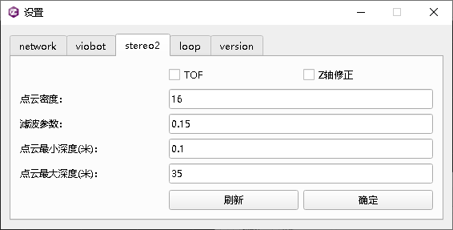

TOF：勾选则使用TOF建图，如果勾选但是没有开启TOF传感器，stereo2将会一直卡在初始化状态。

Z轴修正：用于修正Z轴偏差，默认关，如果Z轴偏差过大建议勾选。

点云密度：pro版默认设置为16，基础版默认32。

滤波参数：设置过滤点云的孤立点，单位m，建议0.15。

点云最小深度：0.1以内的点深度准确性变低，不建议设置更小的值，往大了设可以屏蔽一些特别近的噪

&#x20;                      点，单位（m）

点云最大深度：深度管理的最大半径，室外大场景可以设置为100.默认室内20\~35即可。

#### 4)loop

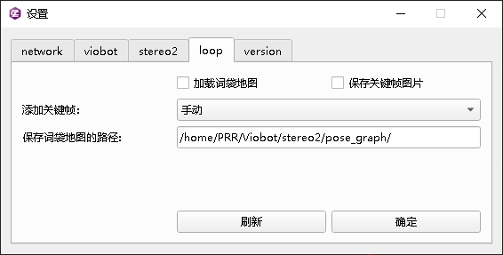

加载词袋地图：在使用历史词袋地图时，勾选会自动加载下面路径下的词袋地图。

保存关键帧图片：勾选则会保存所有关键帧的图片到下面那个路径下，一般不勾选，因为会占用太多磁

&#x20;                         盘空间。

添加关键帧：设置添加关键帧的方式：手动/自动；设置为手动，在没有手动添加关键帧时，可以屏蔽掉                     回环的影响。

保存词袋地图的路径：设置保存词袋地图的路径。注意：该路径是在设备上的。

#### 5）version

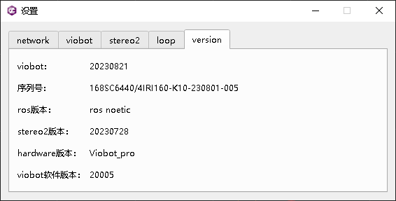

这页记录了这台设备的基本信息，以及程序的版本。
