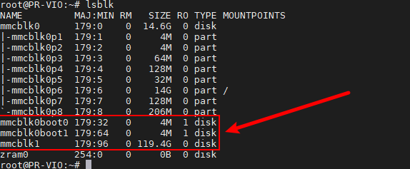
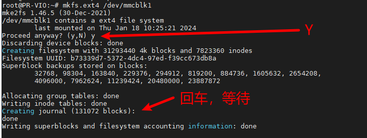
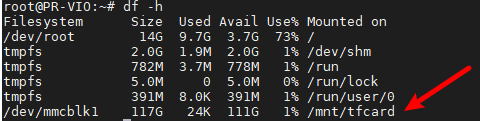

# TF卡挂载

将TF卡插到Viobot的卡槽里面，注意TF卡的存储速度。

查看TF卡

```bash
lsblk
```



可以看到新增了一个119.4G的存储块，也就是刚插进去的TF卡，名字是`mmcblk1`

Viobot系统不支NTFS格式的TF卡，需要存储大文件的化我们可以把TF卡格式化为EXT4格式，注意如果使用的内存卡不是空的，格式化之前，请自行备份保存好自己的文件。

格式化TF卡

```bash
sudo mkfs.ext4 /dev/mmcblk1 
```



挂载

```bash
sudo mkdir /mnt/tfcard
sudo mount /dev/mmcblk1 /mnt/tfcard
```

查看挂载

```bash
df -h
```



可以看到/dev/mmcblk1已经被正确挂载到了/mnt/tfcard

卸载

```bash
sudo umount /dev/mmcblk1
```
