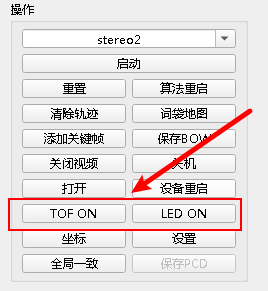
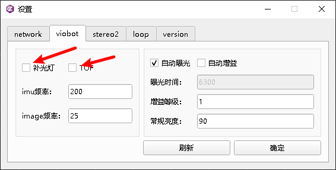
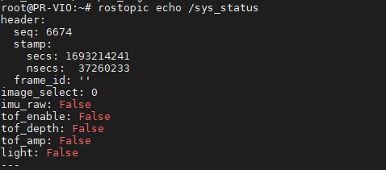
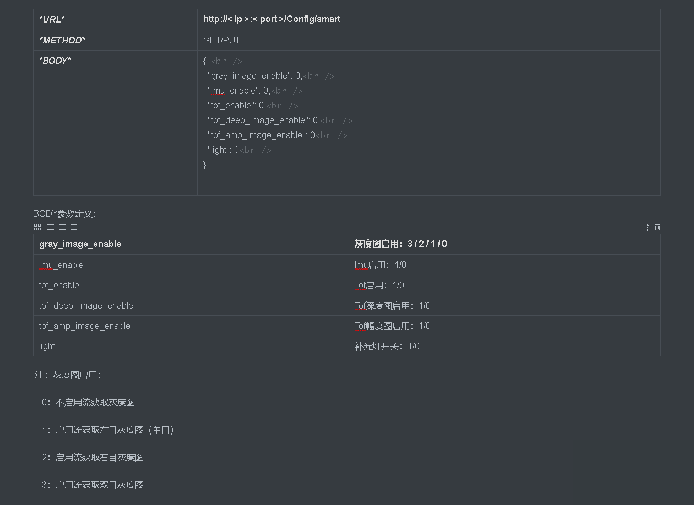
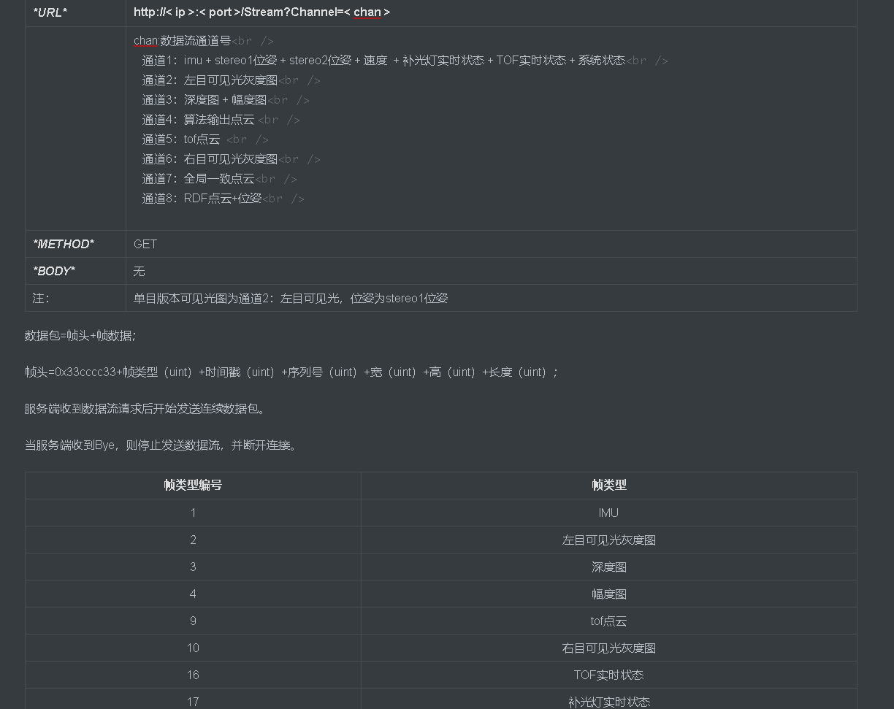

# Viobot硬件控制

## 目录

-   [一.使用上位机控制](#一使用上位机控制)
-   [二.ROS控制](#二ROS控制)
    -   [1）TOF开关（TOF版本）](#1TOF开关TOF版本)
    -   [2）补光灯开关（补光灯版）](#2补光灯开关补光灯版)
    -   [3）raw\_data输出设置](#3raw_data输出设置)
-   [三.ROS状态反馈](#三ROS状态反馈)
-   [四.http控制](#四http控制)
-   [五.http状态反馈](#五http状态反馈)

### 一.使用上位机控制



&#x20;TOF版本设备点击TOF ON即可开启TOF，开启后按键会变成TOF OFF，点击TOF OFF即可关闭TOF

&#x20;补光灯版本设备点击LED ON即可开启LED ，开启后按键会变成LED OFF，点击LED OFF即可关闭LED&#x20;



设置页面的viobot栏，补光灯前面的勾打上，就默认设备上电会开启补光灯，TOF前面的勾打上，就默认设备上电会开启TOF。

### 二.ROS控制

我们已经把硬件的控制和反馈信息写成了一个自定义的ros msg，具体的msg信息可以查看demo里面的msg包的viobot\_ctrl.msg

```bash
Header header
int32 image_select #0/1/2/3 (注：0：无图像通过流数据输出；1：左目；2：右目；3：双目图像通过流数据输出)
bool imu_raw #ON/OFF
bool tof_enable #ON/OFF
bool tof_depth #ON/OFF
bool tof_amp #ON/OFF
bool light #ON/OFF
```

这里面包含了三类操作

#### 1）TOF开关（TOF版本）

tof\_enable  true为开，false为关

开启TOF

```bash
rostopic pub -1 /system_ctrl system_ctrl/viobot_ctrl "{header: {seq: 0, stamp: {secs: 0, nsecs: 0}, frame_id: ''}, image_select: 0, imu_raw: false, tof_enable: true, tof_depth: false, tof_amp: false, light: false}"

```

关闭TOF

```bash
rostopic pub -1 /system_ctrl system_ctrl/viobot_ctrl "{header: {seq: 0, stamp: {secs: 0, nsecs: 0}, frame_id: ''}, image_select: 0, imu_raw: false, tof_enable: false, tof_depth: false, tof_amp: false, light: false}"

```

#### 2）补光灯开关（补光灯版）

light  true为开，false为关

开启补光灯

```bash
rostopic pub -1 /system_ctrl system_ctrl/viobot_ctrl "{header: {seq: 0, stamp: {secs: 0, nsecs: 0}, frame_id: ''}, image_select: 0, imu_raw: false, tof_enable: false, tof_depth: false, tof_amp: false, light: true}"

```

关闭补光灯

```bash
rostopic pub -1 /system_ctrl system_ctrl/viobot_ctrl "{header: {seq: 0, stamp: {secs: 0, nsecs: 0}, frame_id: ''}, image_select: 0, imu_raw: false, tof_enable: false, tof_depth: false, tof_amp: false, light: false}"
```

#### 3）raw\_data输出设置

```bash
int32 image_select #0/1/2/3 (注：0：无图像通过流数据输出；1：左目；2：右目；3：双目图像通过流数据输出)
bool imu_raw #ON/OFF
bool tof_depth #ON/OFF
bool tof_amp #ON/OFF

```

raw\_data输出设置是设置到http流输出的，默认是关的，如果使用ROS开发也不需要开，一直都是false就行。

ROSdemo里面的例子

```c++
ros::Publisher pub_sys_ctrl = nh.advertise<system_ctrl::viobot_ctrl>("/system_ctrl", 2);

system_ctrl::viobot_ctrl viobot_set;
viobot_set.image_select = 0;
viobot_set.imu_raw = false;
viobot_set.tof_enable = false;
viobot_set.tof_amp = false;
viobot_set.tof_depth = false;
viobot_set.light = false;

ros::Rate r(10);
int v;

while(ros::ok()){
  std::cin >> v;
  if(v == 3){
      ROS_INFO("tof_enable");
      viobot_set.tof_enable = true;
      pub_sys_ctrl.publish(viobot_set);
  }
  if(v == 4){
      ROS_INFO("tof_disable");
      viobot_set.tof_enable = false;
      pub_sys_ctrl.publish(viobot_set);
  }
  if(v == 5){
      ROS_INFO("light_enable");
      viobot_set.light = true;
      pub_sys_ctrl.publish(viobot_set);
  }
  if(v == 6){
      ROS_INFO("light_disable");
      viobot_set.light = false;
      pub_sys_ctrl.publish(viobot_set);
  }
  r.sleep();
  ros::spinOnce(); 
}

```

### 三.ROS状态反馈

```bash
Type: system_ctrl::viobot_ctrl
Topic: /sys_status

```



这个话题是一秒发送一次的。

ROSdemo里面的例子

```c++
ros::Subscriber sub_sys_status = nh.subscribe("/sys_status", 2, sys_status_callback);//注册订阅回调

```

回调函数，1s触发一次，打印接收到的消息。

```c++
void sys_status_callback(const system_ctrl::viobot_ctrl::ConstPtr &msg){
    ROS_INFO("sys_status:");
    if(msg->image_select == 1) std::cout << "image_select: " << "left" << std::endl;
    else if(msg->image_select == 2) std::cout << "image_select: " << "right" << std::endl;
    else if(msg->image_select == 3) std::cout << "image_select: " << "left and right" << std::endl;
    else std::cout << "image_select: " << "OFF" << std::endl;

    if(msg->imu_raw == false) std::cout << "imu_raw: " << "OFF" << std::endl;
    else std::cout << "imu_raw: " << "ON" << std::endl;

    if(msg->tof_depth == false) std::cout << "tof_depth: " << "OFF" << std::endl;
    else std::cout << "tof_depth: " << "ON" << std::endl;

    if(msg->tof_enable == false) std::cout << "tof_enable: " << "OFF" << std::endl;
    else std::cout << "tof_enable: " << "ON" << std::endl;

    if(msg->tof_amp == false) std::cout << "tof_amp: " << "OFF" << std::endl;
    else std::cout << "tof_amp: " << "ON" << std::endl;

    if(msg->light == false) std::cout << "light: " << "OFF" << std::endl;
    else std::cout << "light: " << "ON" << std::endl;
}
```

### 四.http控制

HTTP协议主要用于参数读写及流数据获取，默认端口8000

按照协议发送即可（补光灯版没有TOF，TOF版没有补光灯）



### 五.http状态反馈


