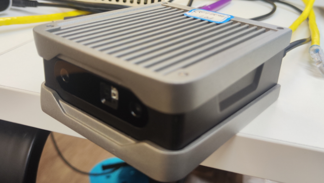
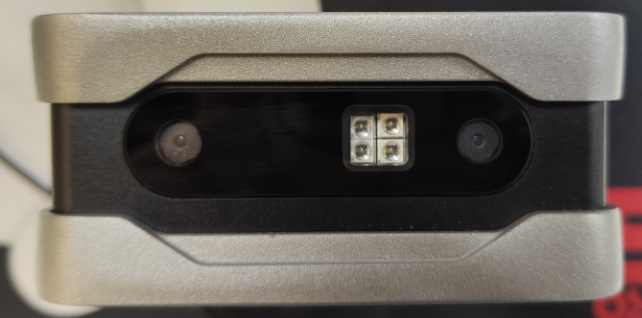
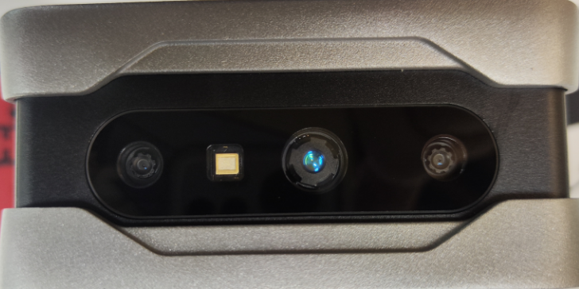
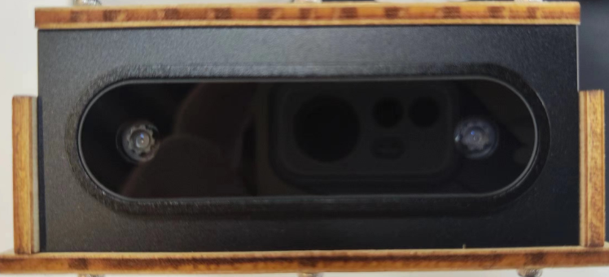
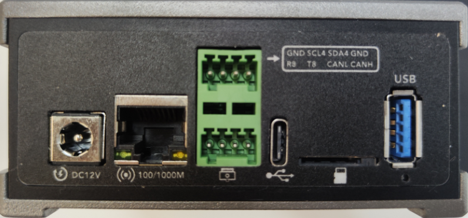

# 硬件组成和接口

Viobot主要由主板、传感器板和外壳组成。具体尺寸可以在用户手册上面找到。

传感器板上面是双目摄像头和IMU，摄像头已经打了胶固定在外壳的前脸，由于涉及到传感器外参标定，所以不可自行拆卸。

LED补光灯版本：

TOF版本：

轻量版：

&#x20;  轻量版没有补光灯或者TOF。

背板接口：

&#x20; 背面接口主要有12VDC电源口(支持11V-17V电压输入)；

&#x20; RJ45千兆网口用作主要的数据通信接口；

&#x20;  2\*4pin的接口，包含了I2C、UART、CAN三种常用接口，设备号分别是I2C6、CAN0,串口设备号：         PRO版为ttyS0,基础版为ttyS8

&#x20; TYPE-C接口，用于升级系统，不用做数据传输接口！！！！！！

&#x20; TF卡槽，支持最大256G高速卡，EXT4格式。

&#x20; USB3.0口，可接一些USB设备作数据交换使用。
