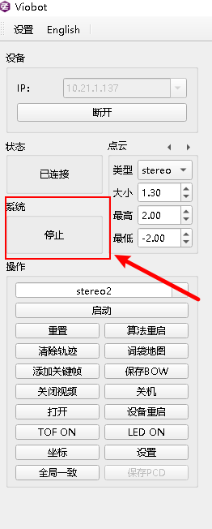
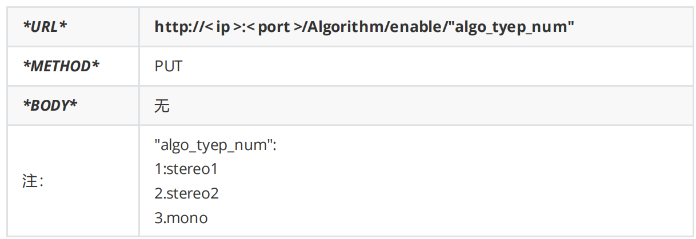
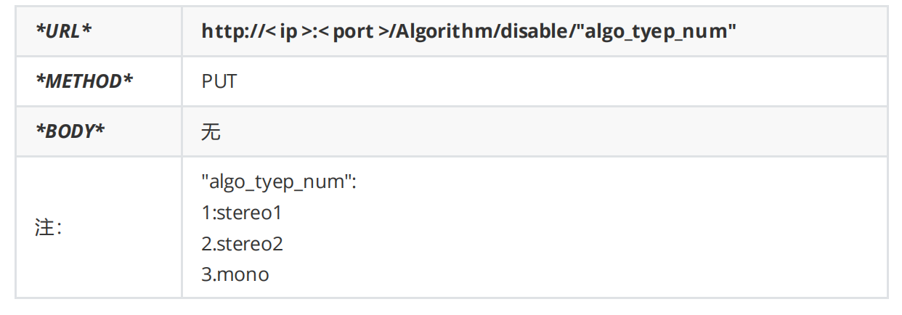
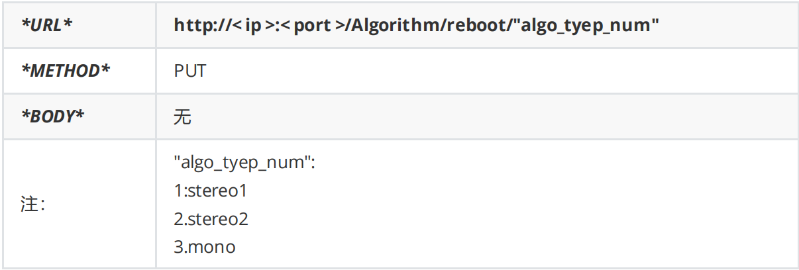
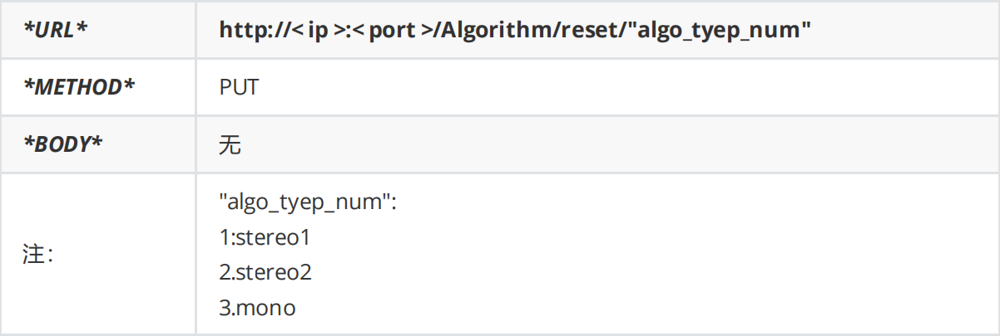
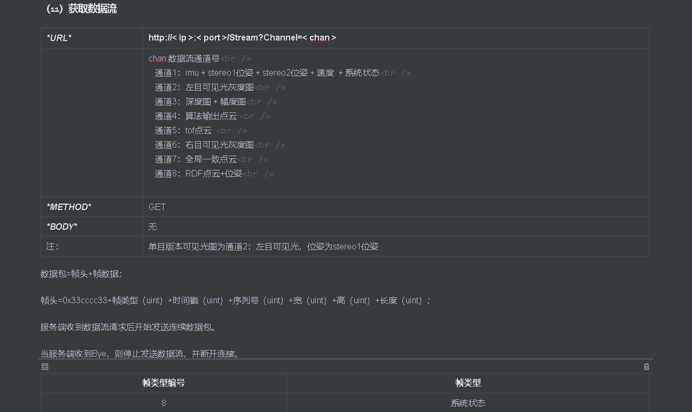

# 算法控制

### 一.上位机控制



&#x20;  状态反馈在系统反馈出会根据当前系统状态显示。

控制是在操作栏里面的一个选项三个按键。具体的已经在前面一篇基本功能使用及介绍中讲过了。

### 二.ROS控制

算法的控制我们也整合成了一个ROS msg，具体的msg信息可以查看demo里面的msg包的algo\_ctrl.msg

```c++
Header header
bool algo_enable
bool algo_reboot
bool algo_reset
```

分别对应着算法启动/停止，算法重启已经算法重置。

话题名如下：

```c++
Type: system_ctrl::algo_ctrl
Topic: /stereo1_ctrl /stereo2_ctrl /mono_ctrl
```

命令行发送话题命令如下：

启动stereo2算法

```bash
rostopic pub -1 /stereo2_ctrl system_ctrl/algo_ctrl "{header: {seq: 0, stamp: {secs: 0, nsecs: 0}, frame_id: ''}, algo_enable: true, algo_reboot: false, algo_reset: false}"

```

停止stereo2算法

```bash
rostopic pub -1 /stereo2_ctrl system_ctrl/algo_ctrl "{header: {seq: 0, stamp: {secs: 0, nsecs: 0}, frame_id: ''}, algo_enable: false, algo_reboot: false, algo_reset: false}"

```

重启stereo2算法

```bash
rostopic pub -1 /stereo2_ctrl system_ctrl/algo_ctrl "{header: {seq: 0, stamp: {secs: 0, nsecs: 0}, frame_id: ''}, algo_enable: true, algo_reboot: true, algo_reset: false}"

```

重置stereo2算法

```bash
rostopic pub -1 /stereo2_ctrl system_ctrl/algo_ctrl "{header: {seq: 0, stamp: {secs: 0, nsecs: 0}, frame_id: ''}, algo_enable: true, algo_reboot: false, algo_reset: true}"

```

ROSdemo里面的例子

```c++
ros::Publisher pub_stereo2_ctrl = nh.advertise<system_ctrl::algo_ctrl>("/stereo2_ctrl", 2);
system_ctrl::algo_ctrl algo_set;
algo_set.algo_enable = false;
algo_set.algo_reboot = false;
algo_set.algo_reset = false;

ros::Rate r(10);
int v;

while(ros::ok()){
    std::cin >> v;
    if(v == 1){//设置时需要注意其他的状态位的情况
        ROS_INFO("algo_enable");
        algo_set.algo_enable = true;
        pub_stereo2_ctrl.publish(algo_set);
    }
    else if(v == 2){
        ROS_INFO("algo_disable");
        algo_set.algo_enable = false;
        pub_stereo2_ctrl.publish(algo_set);
    }
    else if(v == 3){
        ROS_INFO("algo_reboot");
        algo_set.algo_reboot= true;
        algo_set.algo_reset= false;
        pub_stereo2_ctrl.publish(algo_set);
    }
    else if(v == 4){
        ROS_INFO("algo_reset");
        algo_set.algo_reboot= false;
        algo_set.algo_reset= true;
        pub_stereo2_ctrl.publish(algo_set);
    }
    
    r.sleep();
    ros::spinOnce(); 
}

```

ROS2

启动stereo2算法

```bash
ros2 topic pub --once /stereo2_ctrl system_ctrl/AlgoCtrl "{header: {stamp: {sec: 0, nanosec: 0}, frame_id: ''}, algo_enable: true, algo_reboot: false, algo_reset: false}"

```

停止stereo2算法

```bash
ros2 topic pub --once /stereo2_ctrl system_ctrl/AlgoCtrl "{header: {stamp: {sec: 0, nanosec: 0}, frame_id: ''}, algo_enable: false, algo_reboot: false, algo_reset: false}"

```

重启stereo2算法

```bash
ros2 topic pub --once /stereo2_ctrl system_ctrl/AlgoCtrl "{header: {stamp: {sec: 0, nanosec: 0}, frame_id: ''}, algo_enable: true, algo_reboot: true, algo_reset: false}"

```

重置stereo2算法

```bash
ros2 topic pub --once /stereo2_ctrl system_ctrl/AlgoCtrl "{header: {stamp: {sec: 0, nanosec: 0}, frame_id: ''}, algo_enable: true, algo_reboot: false, algo_reset: true}"
```

三.ROS状态反馈


算法的状态也是一个ROS msg，具体的msg信息可以查看demo里面的msg包的algo\_status.msg

```c++
Header header
string algo_status
```

直接字符串打印系统当前算法的状态对应上面枚举类型的七个字符串。

ROSdemo里面的例子

```c++
ros::Subscriber sub_algo_status = nh.subscribe("/algo_status", 2, algo_status_callback);//定义订阅者并注册回调函数
```

回调函数

```c++
void algo_status_callback(const system_ctrl::algo_status::ConstPtr &msg){
    std::cout << "algo_status: " << msg->algo_status << std::endl;
}
```

### 四.http控制

#### 1)VIO算法启用



#### 2）VIO算法停止



#### 3）VIO算法重启



4）VIO算法重置



五.http反馈




```bash
rostopic pub -1 std_msgs/Char /pr_loop/global_consistency "{header: {seq: 0, stamp: {secs: 0, nsecs: 0}, frame_id: ''}, data: 1}"
```

```bash
rostopic pub -1 /stereo2_ctrl system_ctrl/algo_ctrl "{header: {seq: 0, stamp: {secs: 0, nsecs: 0}, frame_id: ''}, algo_enable: true, algo_reboot: false, algo_reset: false}"

```
