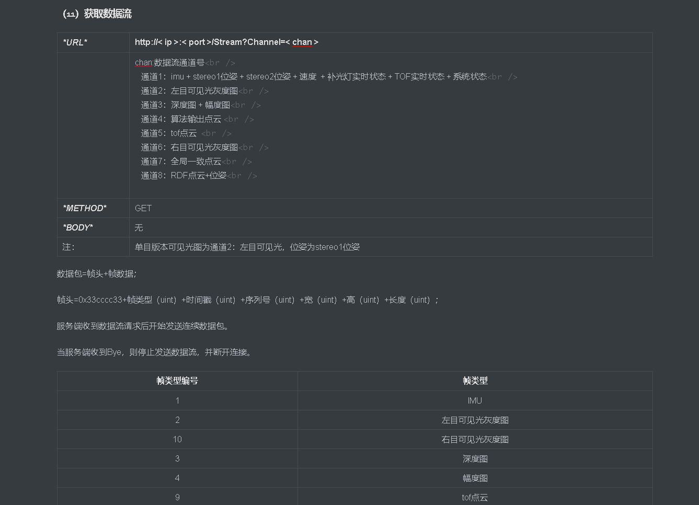
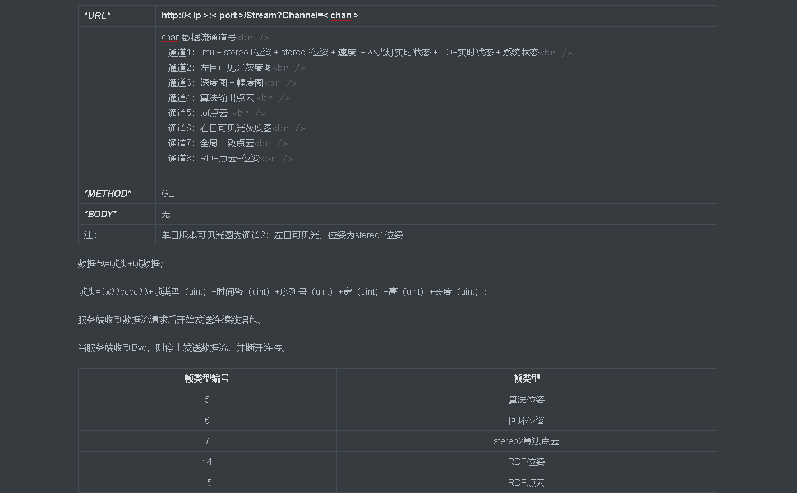
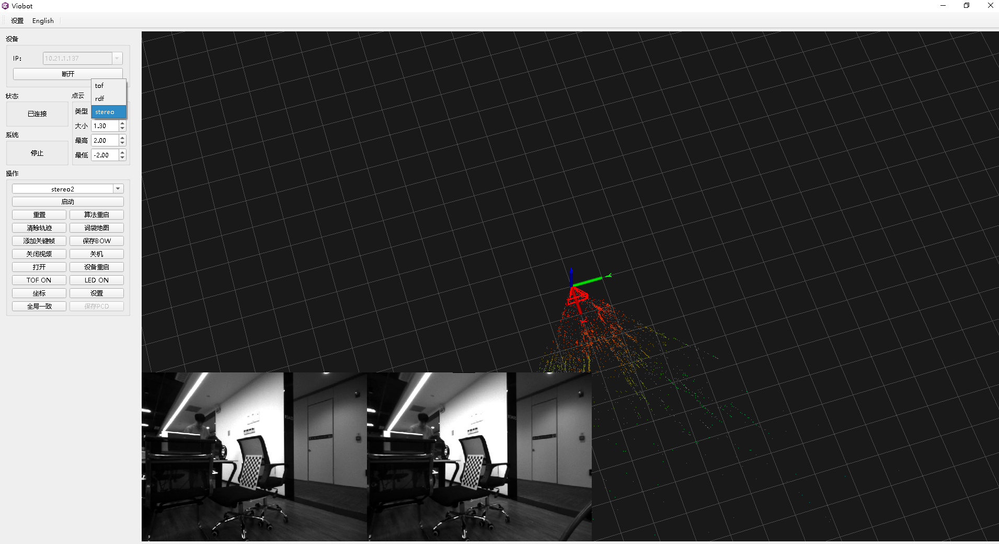
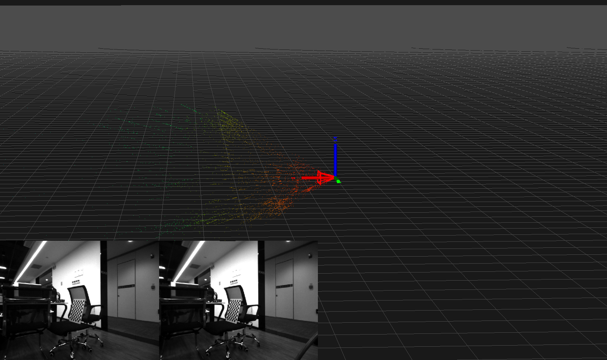
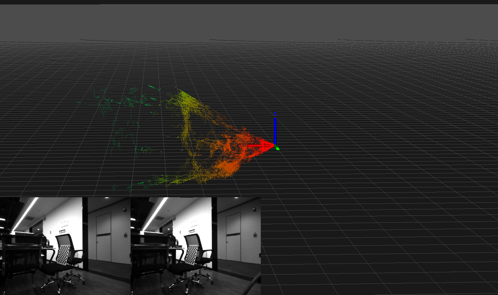
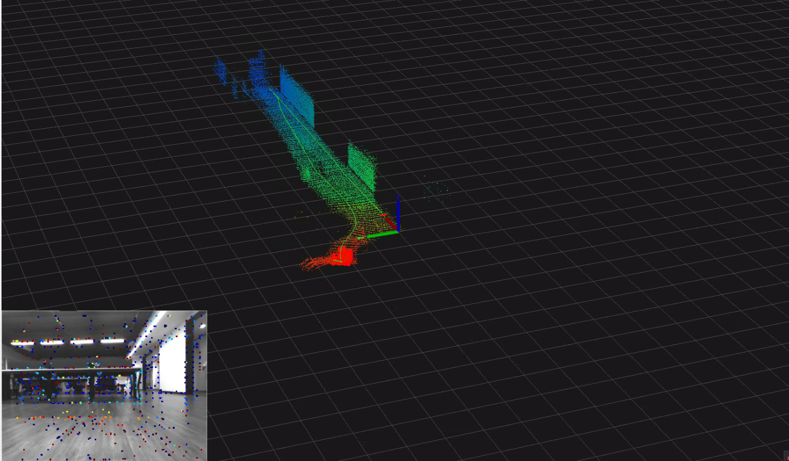
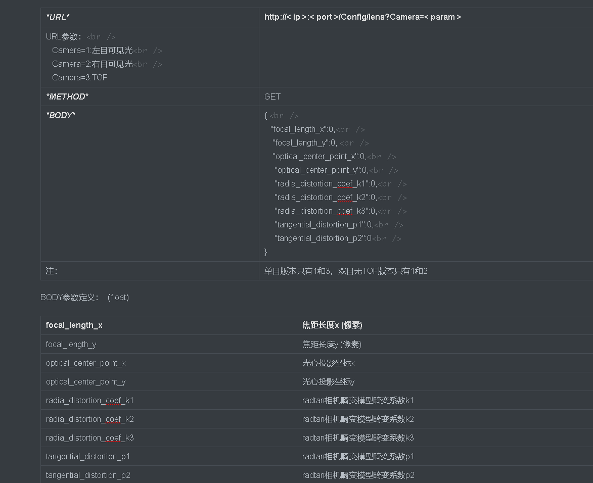
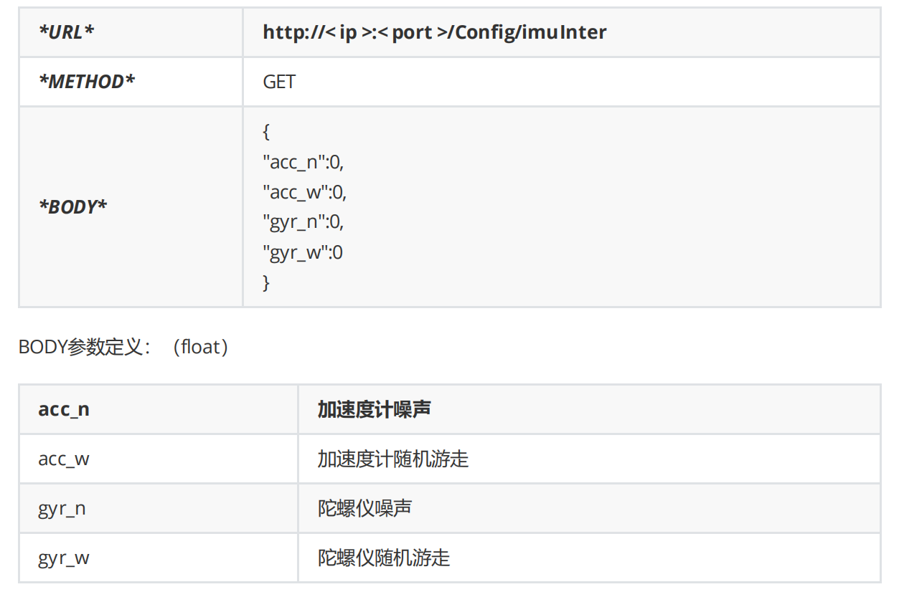

# 输出数据说明

-   [一.原始数据](#一原始数据)
    -   [1.ROS话题](#1ROS话题)
        -   [1)相机原始图像数据](#1相机原始图像数据)
        -   [2）imu数据](#2imu数据)
        -   [3）TOF数据](#3TOF数据)
        -   [4）系统状态](#4系统状态)
    -   [2.http输出](#2http输出)
-   [二.算法输出](#二算法输出)
    -   [1.位姿](#1位姿)
    -   [2.点云](#2点云)
    -   [（1）stereo2点云](#1stereo2点云)
    -   [（2）RDF点云](#2RDF点云)
    -   [（3）TOF融合点云（TOF版）](#3TOF融合点云TOF版)
    -   [（4）其他点云](#4其他点云)
-   [三.参数数据](#三参数数据)
    -   [1.相机内参](#1相机内参)
        -   [1）ROS话题](#1ROS话题)
        -   [2）http](#2http)
    -   [2.imu内参](#2imu内参)
    -   [3.外参文件](#3外参文件)

## 一.原始数据

### 1.ROS话题

#### 1)相机原始图像数据

Type: `sensor_msgs::Image`

Topic: 左目：`/image_left`  右目：`/image_right`

#### 2）imu数据

Type: `sensor_msgs::Imu`

Topic: `/imu`

#### 3）TOF数据

点云数据：

Type: `sensor_msgs::PointCloud2`

Topic: `/tof_cloud`

(x,y,z)

深度图：

Type: `sensor_msgs::Image`

Topic: `/depth_image`

幅度图：

Type: `sensor_msgs::Image`

Topic: `/amp_image`

#### 4）系统状态

\#此项为自定义的ros msg,可以在SDK例程里面找到

Type: system\_ctrl::viobot\_ctrl

Topic: /sys\_status

### 2.http输出

## 二.算法输出

### 1.位姿

开启stereo2算法后，双目自动完成初始化，直接输出位姿。对应上位机的相机框。

Type: `nav_msgs::Odometry`

Topic:`/pr_loop/odometry_rect`

`Odometry`是包含了位姿(pose)和速度(twist)的.

### 2.点云

点云需要开启stereo2算法后才有输出。

如UI所示的，stereo2输出的点云有三种——stereo2原生点云，RDF点云，以及TOF点云（TOF版本）。

需要注意的是所有点云发送的话题都是实时的，只有用户自己保存每一帧才有历史点云的说法，上位机显示的是所连接设备发上来的所有点云，点云的坐标系是紧跟着以算法开机初始化后的第一个位姿为原点的“世界”系坐标下的。

### （1）stereo2点云

这是直接法直接输出的点云，是根据图片的梯度点计算出来的点深度的集合，所以单帧是成一个散射状态的，这跟摄像头的成像原理有关，当相机运动起来之后，上位机记录的点云多了，才会慢慢的建出一定的形状出来。

此点云的ROS话题为：Type: `sensor_msgs::PointCloud2` Topic:`/pr_loop/points`

注意：点云生成是在产生新的关键帧的时候，所以点云的发布频率是不固定的，它的发布频率跟位姿发布频率是一致的。

### （2）RDF点云

这是根据stereo2点云经过滤波和补点（增加稠密度）产出的，它的杂点更少，相对于stereo2点云也更加稠密，相对直观，可用于实时避障。

此点云的ROS话题为：Type: `sensor_msgs::PointCloud2` Topic:`/pr_loop/points_rdf`

### （3）TOF融合点云（TOF版）

需要开启TOF。

这是TOF相机数据降采样并融合了相机位姿后的点云，并非TOF的原始点云，可直接用于避障。

此点云的ROS话题为：Type: `sensor_msgs::PointCloud2` Topic:`/pr_loop/tof_points`

发布频率同样是与位姿发布频率一致。

### （4）其他点云

开启算法之后用户可以看到加了一个`_adjusted`后缀的点云

`/pr_loop/points_adjusted`

`/pr_loop/tof_points_adjusted`

这两组是后续建全局先验全局地图使用的，后续教程会慢慢讲解。

## 三.参数数据

### 1.相机内参

#### 1）ROS话题

Type:`sensor_msgs::CameraInfo`
Topic: 左目内参：`/camera_left_info ` 右目内参：`/camera_right_info` tof内参：`/tof_info`

#### 2）http

### 2.imu内参

文件地址："/home/PRR/Viobot/install/share/viobot/cali/imu/imu.yaml"

或者使用http获取

### 3.外参文件

这两个外参文件暂时没有程序获取接口，可以直接访问文件获取。

imu到左目外参文件地址："/home/PRR/Viobot/install/share/viobot/cali/extrinsic/imu\_cam.yaml"

tof到左目外参文件地址："/home/PRR/Viobot/install/share/viobot/cali/tof/tof\_cam.yaml"
