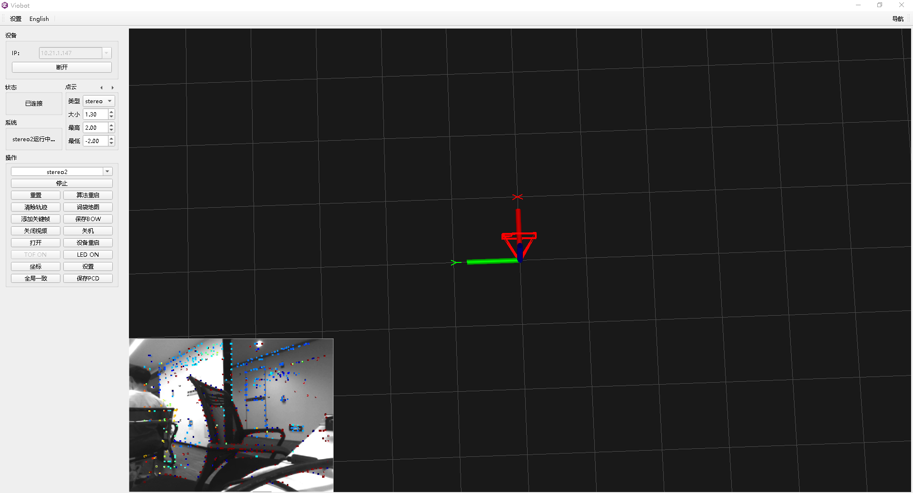
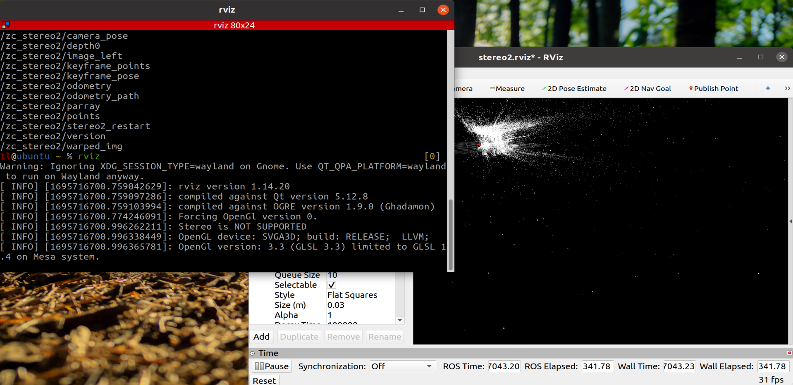

# 运行效果可视化

本篇介绍一下如何将viobot运行算法的结果可视化出来。

#### 1.windows端

在windows端我们做了一个上位机软件用于效果的显示，当然这个是一个基本展示和操作界面，没有什么特别深刻的东西在里面，其实就是对于算法输出的一些话题再通过网络发送到上位机进行效果展示而已。

现在我们可以看到界面上面有一个视频流、一个三维空间坐标系，以及一个相机位姿。

在stereo2运行的状态下，视频流接收的是话题：`/zc_stereo2/warped_img`，这个话题是一张叠加了梯度点的图片，连续起来也就是我们能够看到的一张带深度点的视频流。

位姿接收的话题是：`/pr_loop/odometry_rect`，做了一个相机框，能够更好的看的出相机的朝向。

当有点云生成的时候，接收到的点云话有三个，分别对应点云的显示类型：`/pr_loop/points` `/pr_loop/points_rdf` `/pr_loop/tof_points`

#### 2.ubuntu端

ubuntu端我们现在还没有做上位机，因为有ROS这个很方便的工具在，所以我们可以直接使用ROS的RVIZ作为可视化工具。

首先肯定是先配置ROS主从机了，配置方法已经在前面一篇viobot ROS配置里面讲的很详细了。

然后打开RVIZ，再导入上面的.rviz文件即可。

